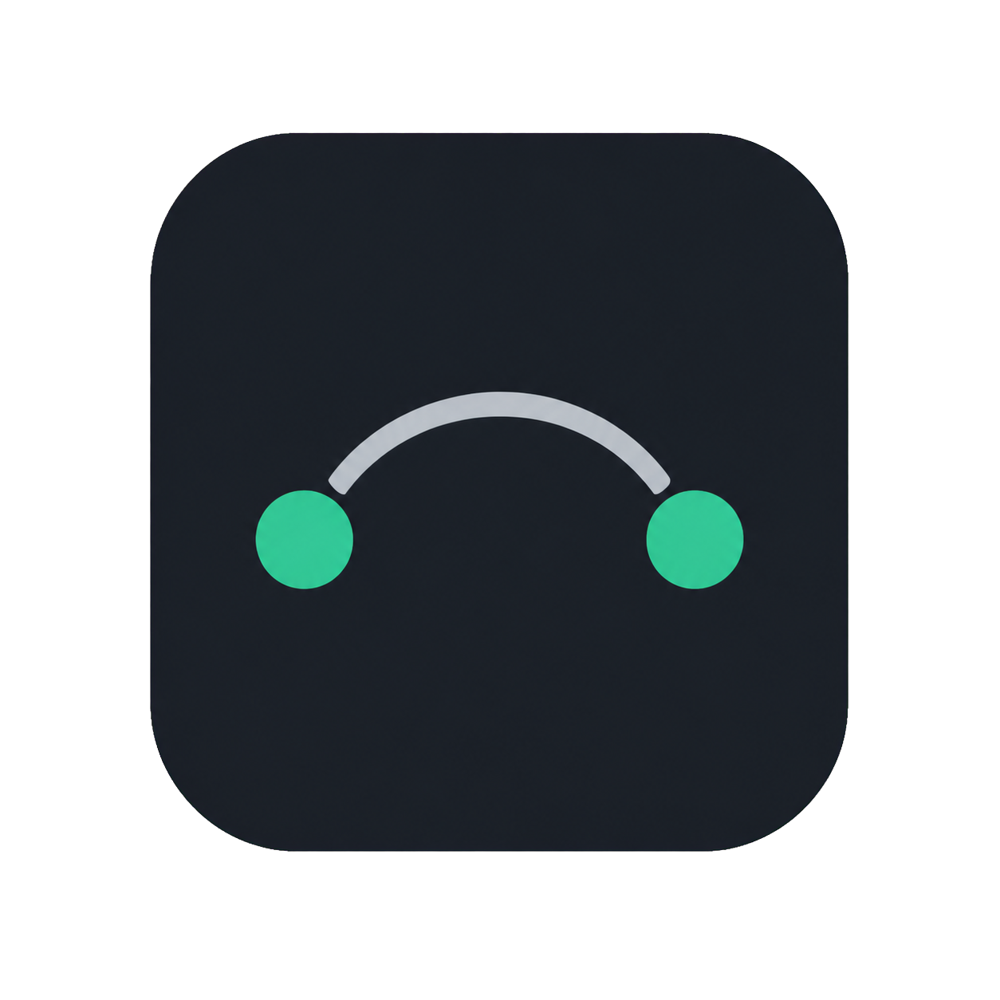

<p align="center">
  
</p>

<h1 align="center">HA Windows Bridge</h1>

<p align="center">
  Integracja komputera z Home Assistant przez lokalny broker MQTT.
</p>

<p align="center">
  <a href="https://github.com/Grzechu51/ha-windows-bridge/actions"></a>
  <a href="https://github.com/Grzechu51/ha-windows-bridge/releases"></a>
  <a href="LICENSE"></a>
</p>

HA Windows Bridge udostępnia Home Assistantowi sterowanie dźwiękiem, stan programów,
dane systemowe, bezpieczne akcje komputera i aktywną sesję multimediów z Windows 10/11.
Aplikacja komunikuje się lokalnie przez MQTT, a integracja instalowana przez HACS
umieszcza wszystkie włączone encje pod jednym urządzeniem **HA Windows Bridge**.

## Najważniejsze możliwości

- główna głośność Windows, wyciszenie i regulacja aktywnej aplikacji;
- osobne regulatory, wyciszenie i stan uruchomienia wybranych programów;
- opcjonalny zdalny start i łagodne zamknięcie programu;
- głośność, wyciszenie i aktywność mikrofonu;
- wybór domyślnego wyjścia audio;
- aktywna aplikacja i okno, pełny ekran, bezczynność oraz blokada sesji;
- stan Windows Update, wymagany restart, plan zasilania i bateria komputera;
- miejsce, transfer, stan SMART i temperatura dysków, jeżeli Windows je udostępnia;
- CPU, RAM, czas pracy oraz automatycznie wykrywana telemetria CPU i GPU;
- Audio: balans, wiele sesji, profile i automatyczne ściszanie z regulacją czułości;
- obecność wybranych urządzeń Plug and Play jako encje Home Assistant;
- bezpieczna nakładka Windows z kolejką, obrazem, QR i paskiem postępu;
- natywny `media_player` z metadanymi, pozycją, komendami i miniaturą;
- opcjonalne przyciski blokady, uśpienia, restartu, wyłączenia i anulowania;
- powiadomienia Windows wysyłane z Home Assistant;
- eksport i import konfiguracji oraz raport diagnostyczny bez danych logowania;
- polski i angielski interfejs, ciemny i jasny motyw, autostart i zasobnik systemowy;
- automatyczne sprawdzanie dostępności nowego wydania na oficjalnym GitHubie.

Każda rozszerzona funkcja jest opcjonalna. Moduły systemu, dysków, audio, urządzeń,
nakładki, zdalnych akcji i powiadomień są domyślnie wyłączone.

## Jak działa integracja

Aplikacja publikuje jeden ograniczony i walidowany opis urządzenia pod:

```text
ha-windows-bridge/devices/<device_id>
```

Integracja HA Windows Bridge odbiera go przez działającą integrację MQTT Home Assistant
i tworzy platformy `number`, `switch`, `binary_sensor`, `sensor`, `button`,
`select`, `notify` oraz `media_player`. Zmiana włączonych funkcji aktualizuje ten
sam wpis, a stabilne identyfikatory zapobiegają powstawaniu kopii encji.

## Wymagania

- Windows 10 lub Windows 11 x64;
- Home Assistant z aktywną integracją MQTT;
- HACS do zalecanej instalacji integracji HA Windows Bridge;

## Przygotowanie MQTT w Home Assistant

Broker działa po stronie Home Assistant, dlatego aplikacja Windows nie może bezpiecznie
zainstalować go ani samodzielnie utworzyć poświadczeń administratora. Home Assistant
potrafi natomiast automatycznie skonfigurować oficjalną aplikację Mosquitto podczas
dodawania integracji MQTT.

1. W Home Assistant otwórz **Ustawienia → Urządzenia i usługi → Dodaj integrację**.
2. Wybierz **MQTT** i skorzystaj z proponowanej konfiguracji Mosquitto Broker albo podaj
   dane własnego brokera.
3. Jeżeli używasz oficjalnej aplikacji Mosquitto, dodaj w jej konfiguracji osobny login,
   np. `ha_windows_bridge_pc`, z silnym i unikalnym hasłem.
4. Uruchom ponownie Mosquitto po zmianie konfiguracji.
5. Do HA Windows Bridge wpisz adres IP lub nazwę hosta Home Assistant, port, nowy login
   i hasło. Nie używaj konta `root`.

Aktualną instrukcję konfiguracji znajdziesz w
[dokumentacji MQTT Home Assistant](https://www.home-assistant.io/integrations/mqtt/)
oraz [dokumentacji Mosquitto Broker](https://github.com/home-assistant/addons/blob/master/mosquitto/DOCS.md).

Dla własnego brokera Mosquitto warto ograniczyć konto do topiców tego programu. Przy
domyślnym głównym topicu punktem wyjścia jest:

```text
user ha_windows_bridge_pc
topic read homeassistant/status
topic readwrite ha-windows-bridge/#
```

Jeżeli zmienisz główny topic lub prefix Home Assistant, dostosuj ACL. Port 1883 bez TLS
jest przeznaczony wyłącznie do zaufanej sieci lokalnej. Nie wystawiaj niezabezpieczonego
brokera do Internetu; poza LAN użyj VPN albo poprawnie skonfigurowanego TLS.

## Instalacja integracji Home Assistant

[](https://my.home-assistant.io/redirect/hacs_repository/?owner=Grzechu51&repository=ha-windows-bridge&category=integration)

1. W HACS otwórz **⋮ → Custom repositories**.
2. Dodaj **https://github.com/Grzechu51/ha-windows-bridge** jako **Integration**.
3. Wyszukaj **HA Windows Bridge**, wybierz **Download** i uruchom Home Assistant ponownie.

Instalacja ręczna polega na skopiowaniu katalogu
`custom_components/ha_windows_bridge` do
`config/custom_components/ha_windows_bridge`, a następnie ponownym uruchomieniu
Home Assistant.

## Instalacja aplikacji Windows

1. Otwórz [najnowsze wydanie](https://github.com/Grzechu51/ha-windows-bridge/releases/latest).
2. Pobierz **HA-Windows-Bridge-Setup-1.2.1.exe**.
3. Porównaj sumę SHA-256 z plikiem **SHA256SUMS-1.2.1.txt**.
4. Uruchom instalator i opcjonalnie utwórz skrót na pulpicie.
5. Uruchom **HA Windows Bridge** z menu Start.

Archiwum **HA-Windows-Bridge-1.2.1-win64.zip** jest wersją przenośną. Po rozpakowaniu
trzeba zachować cały katalog wraz z folderem `_internal`.

## Pierwsza konfiguracja

1. Wpisz adres, port, użytkownika i hasło brokera MQTT.
2. Kliknij **Testuj połączenie**.
3. W **Aplikacje** wykryj uruchomione programy i włącz potrzebne pozycje.
4. W **Funkcje** włącz tylko dane i akcje, które mają być dostępne w Home Assistant.
5. Kliknij **Zapisz i zastosuj**, a następnie uruchom usługę.
6. Home Assistant pokaże wykrytą integrację **HA Windows Bridge**. Potwierdź dodanie
   komputera.

Przycisk **Opublikuj encje ponownie** wysyła ponownie bieżący opis urządzenia. Nie
tworzy nowych identyfikatorów ani duplikatów encji.

## Media Player

Odtwarzacz używa Windows Global System Media Transport Controls. Obsługuje tylko
metadane i komendy udostępnione systemowi przez aktywny program. Miniatura pochodzi
bezpośrednio z sesji Windows, jest weryfikowana i udostępniana przez bezpieczny proxy
obrazu Home Assistant.

Pojedynczy obraz jest ograniczony do 1 MB. Akceptowane są PNG, JPEG, GIF i WebP o
zgodnym typie MIME oraz sygnaturze pliku. Brak miniatury nie blokuje odtwarzacza.

## Moduły rozszerzone

Zakładka **Funkcje** jest podzielona na **Ogólne**, **System i dyski**, **Audio**,
**Urządzenia** i **Nakładka**. Każdą grupę można włączyć niezależnie.

- **Stan Windows i dysków** publikuje Windows Update, wymagany restart, plan zasilania,
  baterię komputera, użycie miejsca, transfer oraz dostępne dane SMART i temperatury.
- **Telemetria CPU i GPU** automatycznie wykrywa sprzęt i publikuje wyłącznie dostępne
  pomiary. NVIDIA używa `nvidia-smi`, a pozostałe czujniki mogą pochodzić z liczników
  Windows albo opcjonalnie uruchomionego LibreHardwareMonitor/OpenHardwareMonitor.
- **Audio** agreguje wszystkie sesje tego samego procesu, udostępnia balans stereo,
  automatyczne ściszanie z regulowaną czułością mikrofonu oraz profile miksu. Profil może
  przełączyć domyślne wyjście całego systemu i uruchomić się wraz z przypisaną aplikacją.
- **Urządzenia** wykrywa urządzenia audio, Bluetooth, USB, kamery, kontrolery, drukarki
  i dyski widoczne jako Plug and Play. Zaznaczone pozycje otrzymują osobny sensor
  podłączenia, którego zmiany można wykorzystać w automatyzacjach.
- **Nakładka** jest zwykłym, nieaktywnym i nieprzechwytującym kliknięć oknem Windows.
  Nie wstrzykuje kodu, nie instaluje hooków i domyślnie nie pojawia się podczas pełnego
  ekranu. Nie daje to gwarancji zgodności z każdym regulaminem anti-cheat.

Windows nie udostępnia stabilnego publicznego API do przypisywania obcej aplikacji do
konkretnego wyjścia audio. Projekt nie używa prywatnego `IAudioPolicyConfigFactory`,
który może zmienić się po aktualizacji systemu. Profile bezpiecznie przełączają wyjście
domyślne dla całego Windows.

## Bezpieczne akcje i powiadomienia

Aplikacja nie wykonuje dowolnych poleceń z MQTT. Obsługiwana jest stała lista akcji:
blokada, uśpienie, restart, wyłączenie i anulowanie. Restart i wyłączenie mają
30-sekundowe opóźnienie, podczas którego można nacisnąć **Cancel Power Action**.
Funkcja jest domyślnie wyłączona.

Zwykła encja `notify` przyjmuje tytuł i tekst. Długość jest ograniczona, retained
commands są ignorowane, a wiadomość pojawia się jako powiadomienie zasobnika Windows.

Po włączeniu nakładki dostępna jest druga encja `notify` do prostych komunikatów oraz
cztery akcje integracji: `show_overlay`, `update_overlay`, `remove_overlay` i
`clear_overlay`. Akcje udostępniają ID, ikonę, obraz, QR, postęp, czas, przypięcie,
narożnik, monitor, rozmiar, układ, przezroczystość i styl. Obraz musi być poprawnym PNG,
JPEG, GIF lub WebP jako `data:image/...;base64` i nie może przekraczać 512 KiB. Jest to
pojedyncza grafika, nie podgląd wideo. Dane są wysyłane przez MQTT tylko przy wywołaniu
akcji i nie są zachowywane przez brokera.

```yaml
action: ha_windows_bridge.show_overlay
target:
  entity_id: notify.pc_windows_overlay
data:
  title: Pobieranie
  message: Aktualizacja aplikacji
  notification_id: update
  progress: 45
  pinned: true
  corner: top_right
  preset: info
```

Układ `media` umieszcza przekazaną okładkę po lewej stronie oraz tytuł, opis i postęp po
prawej. Tytuł i wykonawcę można pobierać z dowolnej encji odtwarzacza za pomocą szablonu:

```yaml
action: ha_windows_bridge.show_overlay
target:
  entity_id: notify.pc_windows_overlay
data:
  title: "{{ state_attr('media_player.spotify', 'media_title') or 'Media Player' }}"
  message: "{{ state_attr('media_player.spotify', 'media_artist') or '' }}"
  image: "data:image/jpeg;base64,TUTAJ_DANE_OBRAZU"
  layout: media
  size: large
  preset: info
```

Pole `image` nie przyjmuje adresu URL ani identyfikatora encji. Dzięki temu aplikacja
Windows nie otrzymuje tokenu Home Assistant i nie pobiera dowolnych adresów sieciowych.
Aktualnie obraz kamery lub zmieniającą się okładkę musi przygotować automatyzacja albo
zewnętrzny skrypt jako URI danych. Bezpośredni wybór encji kamery nie jest jeszcze
włączony, ponieważ oznaczałby przesyłanie prywatnej klatki przez MQTT.

Do jednorazowego przygotowania URI obrazu w PowerShell można użyć:

```powershell
$bytes = [IO.File]::ReadAllBytes("C:\Obrazy\okladka.jpg")
"data:image/jpeg;base64,$([Convert]::ToBase64String($bytes))"
```

`ha_windows_bridge.update_overlay` z tym samym `notification_id` aktualizuje komunikat,
`remove_overlay` usuwa wskazany, a `clear_overlay` czyści całą kolejkę. Kolejka jest
ograniczona do 20 pozycji. Wszystkie akcje sprawdzają uprawnienia do wskazanej encji i
publikują wyłącznie do topicu przypisanego do tego komputera.

## Ikona integracji

Integracja zawiera lokalne warianty `icon.png`, `dark_icon.png`, `logo.png` i
`dark_logo.png`. Home Assistant 2026.3 lub nowszy pobiera je bezpośrednio z katalogu
integracji. Po aktualizacji przez HACS uruchom Home Assistant ponownie; przy zachowanym
starym symbolu wykonaj także pełne odświeżenie strony w przeglądarce, ponieważ obrazy
marki są buforowane.

## Konfiguracja, diagnostyka i czyszczenie

- **Eksportuj** zapisuje konfigurację bez hasła MQTT.
- **Importuj** zachowuje aktualnie zapisane hasło i wymaga potwierdzenia.
- **Raport diagnostyczny** ukrywa hasła, tokeny, broker, użytkownika i główny topic.
- **Wyczyść dane MQTT** usuwa znane zachowane topiki bez odinstalowania aplikacji.
- **Odinstaluj aplikację** osobno pyta, czy przed odinstalowaniem wyczyścić MQTT.

Hasło MQTT jest zabezpieczone przez Windows DPAPI i może zostać odszyfrowane tylko przez
tego samego użytkownika Windows. Dane aplikacji są przechowywane w
`%LOCALAPPDATA%\HAWindowsBridge`.

## Aktualizacje i podpisywanie

Aplikacja może automatycznie sprawdzać oficjalne wydania GitHub i otworzyć stronę
nowszej wersji. Nie pobiera ani nie uruchamia instalatora bez zgody użytkownika.

Skrypt `build.ps1` obsługuje podpis Authenticode dla EXE i instalatora. Publiczne
wydanie będzie podpisane tylko wtedy, gdy autor skonfiguruje własny zaufany certyfikat
Code Signing. Certyfikat i klucz prywatny nie są częścią repozytorium.

```powershell
$env:HAWB_SIGNING_THUMBPRINT = "40_ZNAKOWY_ODCISK_CERTYFIKATU"
.\build.ps1 -Installer
Get-AuthenticodeSignature ".\dist\HA-Windows-Bridge-Setup-1.2.1.exe"
```

Bez certyfikatu pliki nadal można zbudować, ale Windows SmartScreen może wyświetlić
ostrzeżenie. Zawsze publikuj również sumy SHA-256.

## Integracja z limitami Codex

Integracja limitów konta Codex nie jest częścią tego wydania. Sprawdzony projekt
`ofilis/codex-ha-bridge` korzysta z prywatnego tokenu logowania i nieudokumentowanego
endpointu ChatGPT. HA Windows Bridge celowo nie odczytuje pliku logowania Codex ani nie
wysyła takiego tokenu do niepublicznego API. Funkcja może zostać dodana, gdy OpenAI
udostępni stabilny, oficjalny interfejs do odczytu limitów.

## Uruchomienie ze źródeł

Python 3.11 lub nowszy jest wymagany wyłącznie do pracy ze źródłami:

```powershell
python -m venv .venv
.\.venv\Scripts\python.exe -m pip install -c constraints.txt -e ".[dev]"
.\.venv\Scripts\python.exe -m pytest
.\.venv\Scripts\python.exe main.py
```

Budowanie wersji przenośnej, integracji i instalatora:

```powershell
.\build.ps1 -Installer
```

Skrypt uruchamia testy, tworzy ikonę, buduje aplikację, integrację, instalator i plik
sum SHA-256. Wymaga Inno Setup 7 dostępnego jako `iscc.exe` albo w
`tools/InnoSetup/7.0.2`.

## Rozwiązywanie problemów

### Stany docierają, ale sterowanie nie działa

Jeżeli Home Assistant pokazuje `Cannot publish to topic...`, jego własna integracja
MQTT nie jest aktywna lub poprawnie skonfigurowana. Uruchom ją w
**Ustawienia → Urządzenia i usługi → MQTT**, a następnie przeładuj MQTT i HA Windows
Bridge albo uruchom Home Assistant ponownie. Sam działający broker nie wystarcza.

### Brakuje części telemetrii sprzętu

Aplikacja tworzy tylko encje, dla których odczytała wartość. NVIDIA korzysta z
`nvidia-smi.exe`. Część temperatur i poboru mocy AMD/Intel wymaga działającego
LibreHardwareMonitor albo OpenHardwareMonitor udostępniającego sensory przez WMI.

## Ograniczenia

- multimedia zależą od funkcji udostępnianych systemowi Windows przez dany program;
- zakres telemetrii zależy od sterownika, liczników Windows i opcjonalnego dostawcy WMI;
- poziom baterii samego komputera jest obsługiwany; Windows nie udostępnia jednolitego
  źródła poziomu baterii wszystkich akcesoriów, dlatego ich encje pokazują obecność;
- routowanie pojedynczej obcej aplikacji do wyjścia nie jest włączone z powodu braku
  stabilnego publicznego API Windows;
- zdalne zamknięcie programu wysyła łagodne żądanie tylko do widocznych okien;
- aplikacja i integracja wymagają dostępności lokalnego brokera MQTT;
- sprawdzanie aktualizacji wymaga dostępu do API GitHub.

## Licencja i zgłaszanie problemów

Copyright © 2026 Grzechu51.

Projekt jest udostępniany na warunkach
[GNU Affero General Public License v3.0](LICENSE). Zasady odpowiedzialnego zgłaszania
podatności opisuje [SECURITY.md](SECURITY.md).
